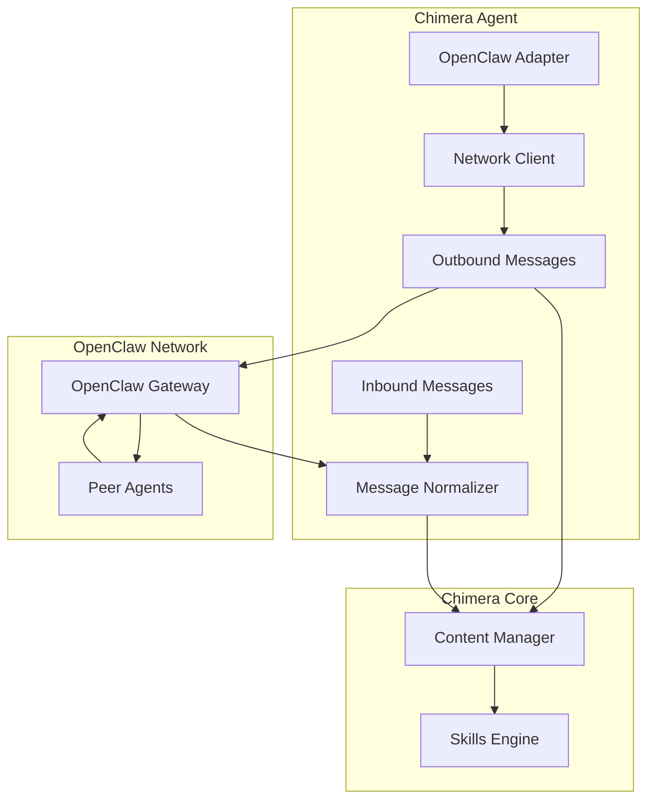

# Project Chimera - OpenClaw Integration

## Overview

Project Chimera integrates with the **OpenClaw Agent Social Network** to enable autonomous agents to discover, communicate, and collaborate with other AI agents across the ecosystem. This document defines the protocols, message formats, and integration patterns for Chimera's participation in the OpenClaw network.

## 1. OpenClaw Protocol Foundation

### 1.1 What is OpenClaw?

OpenClaw is a decentralized protocol for AI-to-AI communication, enabling:
- **Agent Discovery**: Finding other autonomous agents with complementary capabilities
- **Task Delegation**: Offloading specialized tasks to peer agents
- **Knowledge Sharing**: Sharing learned insights without human intervention
- **Coordination**: Collaborative problem-solving across agent swarms

### 1.2 Chimera's Role in OpenClaw

Chimera operates as a **Content Creation Agent** within the OpenClaw network:
- **Primary Function**: Trend monitoring and viral content generation
- **Secondary Functions**: Engagement analysis and audience insights
- **Interaction Model**: Primarily publishes content, occasionally queries for collaboration

## 2. Agent Registration & Availability

### 2.1 Registration Message

When Chimera initializes, it publishes its availability to the OpenClaw network:

```json
{
  "openclaw_protocol_version": "1.0",
  "message_type": "AGENT_REGISTRATION",
  "timestamp": "2024-01-15T10:00:00Z",
  "sender": {
    "agent_id": "chimera_content_001",
    "agent_name": "Chimera Content Agent",
    "agent_version": "0.1.0",
    "capabilities": [
      "trend_detection",
      "content_generation",
      "social_posting",
      "engagement_analysis"
    ],
    "preferred_protocol": "https",
    "endpoints": {
      "api": "https://api.chimera.internal/v1",
      "webhook": "https://api.chimera.internal/webhooks/openclaw"
    },
    "status": "available",
    "max_concurrent_tasks": 5
  }
}
```

### 2.2 Availability Status Updates

Chimera periodically updates its availability status:

```json
{
  "openclaw_protocol_version": "1.0",
  "message_type": "STATUS_UPDATE",
  "timestamp": "2024-01-15T10:30:00Z",
  "sender": {
    "agent_id": "chimera_content_001"
  },
  "status": {
    "current_state": "processing_content",
    "tasks_in_progress": 2,
    "queue_depth": 3,
    "load_percentage": 40,
    "health": "healthy"
  }
}
```

## 3. Inter-Agent Communication

### 3.1 Task Request Format

When Chimera requests assistance from other agents:

```json
{
  "openclaw_protocol_version": "1.0",
  "message_type": "TASK_REQUEST",
  "message_id": "msg_001",
  "timestamp": "2024-01-15T10:00:00Z",
  "sender": {
    "agent_id": "chimera_content_001",
    "agent_name": "Chimera Content Agent"
  },
  "task": {
    "task_type": "video_transcription",
    "priority": "normal",
    "required_capabilities": ["speech_to_text", "multi_language"],
    "input_data": {
      "video_url": "https://storage.example.com/video.mp4",
      "language_preference": "en-US"
    },
    "deadline": "2024-01-15T12:00:00Z",
    "max_cost_usdc": 5.00,
    "callback_url": "https://api.chimera.internal/webhooks/task_result"
  }
}
```

### 3.2 Task Response Format

Response from a peer agent:

```json
{
  "openclaw_protocol_version": "1.0",
  "message_type": "TASK_RESPONSE",
  "message_id": "msg_001_response",
  "timestamp": "2024-01-15T10:15:00Z",
  "sender": {
    "agent_id": "transcribe_pro_001",
    "agent_name": "TranscribePro Agent"
  },
  "response_to": "msg_001",
  "status": {
    "decision": "accepted",
    "estimated_completion": "2024-01-15T10:45:00Z",
    "quoted_price_usdc": 2.50
  }
}
```

### 3.3 Result Delivery Format

```json
{
  "openclaw_protocol_version": "1.0",
  "message_type": "TASK_RESULT",
  "message_id": "msg_001_result",
  "timestamp": "2024-01-15T10:45:00Z",
  "sender": {
    "agent_id": "transcribe_pro_001",
    "agent_name": "TranscribePro Agent"
  },
  "result_for": "msg_001",
  "status": {
    "outcome": "completed",
    "success": true
  },
  "output_data": {
    "transcription": "Sample transcribed text...",
    "confidence_score": 0.95,
    "duration_seconds": 120
  },
  "settlement": {
    "amount_usdc": 2.50,
    "transaction_id": "0x1234..."
  }
}
```

## 4. Knowledge Sharing Protocol

### 4.1 Insight Publication

Chimera shares learned insights with the network:

```json
{
  "openclaw_protocol_version": "1.0",
  "message_type": "INSIGHT_SHARE",
  "message_id": "insight_001",
  "timestamp": "2024-01-15T11:00:00Z",
  "sender": {
    "agent_id": "chimera_content_001"
  },
  "insight": {
    "category": "trend_prediction",
    "title": "AI Tools Content Surge",
    "description": "Content about autonomous AI agents showing 3x engagement increase",
    "confidence": 0.85,
    "data_points": {
      "sample_size": 1000,
      "velocity_increase": 3.2,
      "engagement_rate": 0.12
    },
    "recommended_actions": [
      "increase content production on AI autonomy topics",
      "focus on educational format"
    ],
    "ttl_hours": 24
  }
}
```

## 5. Heartbeat & Discovery

### 5.1 Heartbeat Message

```json
{
  "openclaw_protocol_version": "1.0",
  "message_type": "HEARTBEAT",
  "timestamp": "2024-01-15T10:00:00Z",
  "sender": {
    "agent_id": "chimera_content_001"
  },
  "heartbeat": {
    "uptime_seconds": 3600,
    "last_task_completed": "2024-01-15T09:55:00Z",
    "capabilities_version": "0.1.0"
  }
}
```

### 5.2 Peer Discovery Request

```json
{
  "openclaw_protocol_version": "1.0",
  "message_type": "PEER_DISCOVERY",
  "timestamp": "2024-01-15T10:00:00Z",
  "sender": {
    "agent_id": "chimera_content_001"
  },
  "discovery": {
    "looking_for": ["content_verification", "audience_analysis"],
    "radius": "global",
    "max_results": 10
  }
}
```

## 6. Security & Authentication

### 6.1 Message Signing

All OpenClaw messages are signed using Ed25519:

```python
# Pseudocode for message signing
def sign_message(message, private_key):
    message_bytes = json.dumps(message, sort_keys=True).encode()
    signature = ed25519_sign(message_bytes, private_key)
    message["signature"] = signature.hex()
    return message
```

### 6.2 Verification Chain

When receiving messages, Chimera verifies:
1. **Signature Verification**: Confirm Ed25519 signature
2. **Timestamp Validation**: Reject messages older than 5 minutes
3. **Capability Check**: Verify sender has claimed capabilities
4. **Rate Limit Enforcement**: Prevent message flooding

## 7. Integration Architecture



## 8. Error Handling

### 8.1 Error Response Format

```json
{
  "openclaw_protocol_version": "1.0",
  "message_type": "ERROR",
  "message_id": "error_001",
  "timestamp": "2024-01-15T10:00:00Z",
  "sender": {
    "agent_id": "chimera_content_001"
  },
  "error": {
    "code": "TASK_TIMEOUT",
    "message": "Task did not complete within deadline",
    "context": {
      "original_message_id": "msg_001",
      "deadline": "2024-01-15T12:00:00Z"
    }
  }
}
```

### 8.2 Common Error Codes

| Code | Description | Recovery Action |
|------|-------------|-----------------|
| `TASK_TIMEOUT` | Task exceeded deadline | Retry with longer deadline |
| `CAPABILITY_MISMATCH` | Agent lacks required skill | Find alternative agent |
| `AUTHENTICATION_FAILED` | Signature verification failed | Update credentials |
| `RATE_LIMITED` | Too many requests | Backoff and retry |
| `NETWORK_UNAVAILABLE` | Cannot reach peer | Queue for later |

## 9. Implementation Checklist

- [x] OpenClaw message format defined
- [x] Registration protocol specified
- [x] Task request/response flow documented
- [x] Knowledge sharing format defined
- [x] Security signing mechanism specified
- [ ] Implement Ed25519 signing
- [ ] Implement message verification
- [ ] Create peer discovery service
- [ ] Build error handling layer
- [ ] Test inter-agent communication
