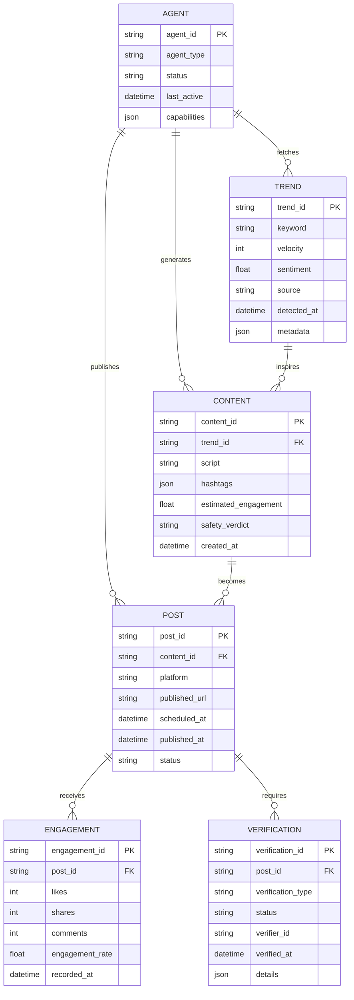

# Project Chimera - Technical Specifications

## 1. API Contracts

### 1.1 Agent API Endpoints

#### Trend Fetcher Service
**Endpoint:** `POST /api/v1/trends/fetch`

**Request Schema (JSON):**
```json
{
  "source": "moltbook",
  "time_window": "1h",
  "velocity_threshold": 100,
  "max_results": 50
}
```

**Response Schema (JSON):**
```json
{
  "status": "success",
  "data": {
    "trends": [
      {
        "id": "trend_001",
        "keyword": "autonomous_ai",
        "velocity": 1500,
        "sentiment": 0.75,
        "sources": ["twitter", "moltbook"],
        "timestamp": "2024-01-15T10:30:00Z"
      }
    ]
  },
  "metadata": {
    "fetch_duration_ms": 245,
    "total_results": 42
  }
}
```

#### Content Generator Service
**Endpoint:** `POST /api/v1/content/generate`

**Request Schema (JSON):**
```json
{
  "trend_id": "trend_001",
  "content_type": "short_video",
  "platform": "moltbook",
  "style_presets": ["viral", "engaging"],
  "safety_check": true
}
```

**Response Schema (JSON):**
```json
{
  "status": "success",
  "data": {
    "content_id": "content_001",
    "generated_content": {
      "script": "AI takes over...",
      "hashtags": ["#AI", "#Autonomous"],
      "estimated_engagement": 0.85
    },
    "safety_verdict": "approved"
  }
}
```

#### Post Publisher Service
**Endpoint:** `POST /api/v1/posts/publish`

**Request Schema (JSON):**
```json
{
  "content_id": "content_001",
  "scheduled_time": "2024-01-15T12:00:00Z",
  "platforms": ["moltbook"],
  "approval_id": "approval_001"
}
```

**Response Schema (JSON):**
```json
{
  "status": "success",
  "data": {
    "post_id": "post_001",
    "published_url": "https://moltbook.com/p/12345",
    "published_at": "2024-01-15T12:00:00Z"
  }
}
```

### 1.2 Webhook Contracts

#### Human Approval Webhook
**Endpoint:** `POST /webhooks/approval`

**Request Schema (JSON):**
```json
{
  "approval_id": "approval_001",
  "request_type": "high_value_transaction",
  "amount_usdc": 15.50,
  "recipient": "0x742d35Cc6634C0532925a3b844Bc9e7595f7b5c9",
  "description": "Content promotion budget",
  "timestamp": "2024-01-15T10:00:00Z"
}
```

**Response Schema (JSON):**
```json
{
  "decision": "approved",
  "approver": "human_001",
  "reason": "Verified campaign partner",
  "timestamp": "2024-01-15T10:05:00Z"
}
```

## 2. Database Schema

### 2.1 Entity Relationship Diagram (ERD)



### 2.2 Table Definitions

#### Table: `agents`
```sql
CREATE TABLE agents (
    agent_id VARCHAR(64) PRIMARY KEY,
    agent_type VARCHAR(32) NOT NULL,
    status VARCHAR(16) DEFAULT 'active',
    last_active TIMESTAMP DEFAULT CURRENT_TIMESTAMP,
    capabilities JSONB DEFAULT '[]',
    created_at TIMESTAMP DEFAULT CURRENT_TIMESTAMP,
    updated_at TIMESTAMP DEFAULT CURRENT_TIMESTAMP
);

CREATE INDEX idx_agents_status ON agents(status);
CREATE INDEX idx_agents_type ON agents(agent_type);
```

#### Table: `trends`
```sql
CREATE TABLE trends (
    trend_id VARCHAR(64) PRIMARY KEY,
    keyword VARCHAR(255) NOT NULL,
    velocity INTEGER NOT NULL,
    sentiment DECIMAL(4,3),
    source VARCHAR(64) NOT NULL,
    detected_at TIMESTAMP NOT NULL,
    metadata JSONB DEFAULT '{}',
    created_at TIMESTAMP DEFAULT CURRENT_TIMESTAMP
);

CREATE INDEX idx_trends_keyword ON trends(keyword);
CREATE INDEX idx_trends_velocity ON trends(velocity DESC);
CREATE INDEX idx_trends_detected ON trends(detected_at DESC);
```

#### Table: `content`
```sql
CREATE TABLE content (
    content_id VARCHAR(64) PRIMARY KEY,
    trend_id VARCHAR(64) REFERENCES trends(trend_id),
    script TEXT NOT NULL,
    hashtags JSONB DEFAULT '[]',
    estimated_engagement DECIMAL(4,3),
    safety_verdict VARCHAR(16) NOT NULL,
    created_at TIMESTAMP DEFAULT CURRENT_TIMESTAMP
);

CREATE INDEX idx_content_trend ON content(trend_id);
CREATE INDEX idx_content_safety ON content(safety_verdict);
```

#### Table: `posts`
```sql
CREATE TABLE posts (
    post_id VARCHAR(64) PRIMARY KEY,
    content_id VARCHAR(64) REFERENCES content(content_id),
    platform VARCHAR(32) NOT NULL,
    published_url VARCHAR(512),
    scheduled_at TIMESTAMP,
    published_at TIMESTAMP,
    status VARCHAR(16) DEFAULT 'draft',
    created_at TIMESTAMP DEFAULT CURRENT_TIMESTAMP
);

CREATE INDEX idx_posts_status ON posts(status);
CREATE INDEX idx_posts_scheduled ON posts(scheduled_at);
```

#### Table: `engagement`
```sql
CREATE TABLE engagement (
    engagement_id VARCHAR(64) PRIMARY KEY,
    post_id VARCHAR(64) REFERENCES posts(post_id),
    likes INTEGER DEFAULT 0,
    shares INTEGER DEFAULT 0,
    comments INTEGER DEFAULT 0,
    engagement_rate DECIMAL(4,3),
    recorded_at TIMESTAMP DEFAULT CURRENT_TIMESTAMP
);

CREATE INDEX idx_engagement_post ON engagement(post_id);
```

#### Table: `verifications`
```sql
CREATE TABLE verifications (
    verification_id VARCHAR(64) PRIMARY KEY,
    post_id VARCHAR(64) REFERENCES posts(post_id),
    verification_type VARCHAR(32) NOT NULL,
    status VARCHAR(16) NOT NULL,
    verifier_id VARCHAR(64),
    verified_at TIMESTAMP,
    details JSONB DEFAULT '{}',
    created_at TIMESTAMP DEFAULT CURRENT_TIMESTAMP
);

CREATE INDEX idx_verifications_post ON verifications(post_id);
CREATE INDEX idx_verifications_status ON verifications(status);
```

## 3. JSON Schemas

### 3.1 Trend Data Schema
```json
{
  "$schema": "http://json-schema.org/draft-07/schema#",
  "title": "Trend",
  "type": "object",
  "properties": {
    "trend_id": {"type": "string", "pattern": "^trend_[0-9]{3}$"},
    "keyword": {"type": "string", "maxLength": 255},
    "velocity": {"type": "integer", "minimum": 0},
    "sentiment": {"type": "number", "minimum": -1, "maximum": 1},
    "source": {"type": "string", "enum": ["twitter", "moltbook", "instagram"]},
    "detected_at": {"type": "string", "format": "date-time"},
    "metadata": {"type": "object"}
  },
  "required": ["trend_id", "keyword", "velocity", "detected_at"]
}
```

### 3.2 Content Generation Request Schema
```json
{
  "$schema": "http://json-schema.org/draft-07/schema#",
  "title": "ContentGenerationRequest",
  "type": "object",
  "properties": {
    "trend_id": {"type": "string", "pattern": "^trend_[0-9]{3}$"},
    "content_type": {"type": "string", "enum": ["short_video", "image", "text", "thread"]},
    "platform": {"type": "string", "enum": ["moltbook", "twitter", "instagram"]},
    "style_presets": {
      "type": "array",
      "items": {"type": "string"},
      "minItems": 1,
      "maxItems": 5
    },
    "safety_check": {"type": "boolean", "default": true}
  },
  "required": ["trend_id", "content_type", "platform"]
}
```

### 3.3 Agent Capability Schema
```json
{
  "$schema": "http://json-schema.org/draft-07/schema#",
  "title": "AgentCapability",
  "type": "object",
  "properties": {
    "skill_id": {"type": "string"},
    "version": {"type": "string"},
    "enabled": {"type": "boolean"},
    "parameters": {"type": "object"}
  }
}
```

## 4. Technology Stack

| Component | Technology | Version |
|-----------|------------|---------|
| Runtime | Python | 3.12+ |
| Framework | FastMCP | 0.1.0+ |
| Database | PostgreSQL | 15+ |
| ORM | SQLAlchemy | 2.0+ |
| Container | Docker | 24.0+ |
| Package Manager | UV | Latest |
| Agent Toolkit | Coinbase AgentKit | 0.0.5+ |
